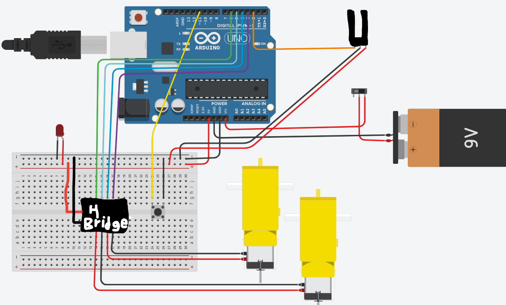

# Drag Racer - Engineering 2 (Dom & Zac)


## Table of Contents 
* [Planning Stage](https://github.com/dcaffer07/Drag-Racer/blob/main/README.md#planning---detailed-description-with-images) 
* [Materials Used](https://github.com/dcaffer07/Drag-Racer/blob/main/README.md#materials-used)
* [CAD Model](https://github.com/dcaffer07/Drag-Racer/blob/main/README.md#cad-model---link-and-images)
* [Wiring Diagram](https://github.com/dcaffer07/Drag-Racer/blob/main/README.md#wiring-diagram-fritzing-links-to-an-external-site-tinkercad-circuits-or-hand-drawings) 
* [Arduino Code](https://github.com/dcaffer07/Drag-Racer/blob/main/README.md#arduino-code---must-include-comments)
* [Final Design/Product](https://github.com/dcaffer07/Drag-Racer/blob/main/README.md#final-designproduct)
* [Reflection](https://github.com/dcaffer07/Drag-Racer/blob/main/README.md#reflection---include-an-in-depth-discussion-of-problems-errors-miscalculations-and-missteps-and-how-you-overcame-them)


## Planning - detailed description with images
#### Purpose & Expectations
> To work diligently in order to create a product that improves and expands our overall knowledge of how basic engineering operates.  We are expected to work professionally, using our time and resources wisely.  We are expected to work with our partners efficiently to create an object that operates under the parameters provided. With this we will create a device that incorporates all of the aspects of engineering we have learned about to scare and startle those who aren’t scared and startled enough in an effort to make the world a less scared-and-startle-free space.

#### Description (establishing the foundation)
> Design, Build, and Program a Drag Race Car to safely and quikly travel a length of 10ft and across the finish line in the fastest time.  Have a photointerrupter putt at the most front portion of your car. Allow adjustment of your photointerrupter to have a height between 80mm and 100mm. Pushbutton must be included. Work in a partnerhsip and get to work!

#### Planning Document
[Here is the planning doc that was created pre-creation](https://docs.google.com/document/d/14ydlslu0jilWMhaa84WuWhr467ZRmgDgo2GTIVmntT8/edit#heading=h.ukbi0a75zb46)

#### Initial Sketch
 

#### Reflection of Planning (done post project)
> All in all i think that our planning went well. In all honestly I wish that we had looked more closely into the logic behind things, ball as I said, the project turnmed out similaraly to as we expected.  Howver with that being said, here are some things that I wish I had known or looked more closely into before the assignment...
>- We did not really consider the buttons role in the project. Come run time, we had no way tto acces the button while still having the frame on tope of the car.
>- I would have liked to have left more space in most aspects... this was the case in the wheel situation, as the wheels initially didnt fit so we had to sand the base down.  This was also the case in the gears as they were more taught than anticpated.  
>- I would have like to more closely pay attention to the timeline aspect of planning.  I feel like we were nonchalaunt in the biggining, and crunching for time toward the end.  But we got it done.
>- Complete engineering noteboom as you go along.  I have said this before and I say it again, it is a mistake that we have made and I consistently seen my classmates make... do notebook!
>
> As stated, our planning was not perfect, but it was sufficient and seemed to work well enough.  

____
## Materials Used
>- Acrylic (base of box and windows)
>- 3d printer (gears, gear shaft, outer frame, moter holders)
>- Standard button (for initialization)
>- Wires 
>- T-Slot Photointerupter (To send racer)
>- H-Bridge (signals servo to stop)
>- TT Motor X 2
>- Panel Mount LED
>- Panel Mount Switch
>- Arduino...  prototyping sheild... mini bread board
>- Battery pack (6 x AA)
>- Screws/nuts/washers... assorted
_____
## CAD Model - Link and Images
#### Description
> While planning, we liked the idea of an open concept car.  This was the case because although we wanted an outer shell in order for the object to look like a car, we liked the idea of being able to see the insides of the device.  This design concists of a base, which holds all of the neccesary electronics along with the gears and shaft mechamism, while having an outer shell frame made of 3D printed material, covered in clear acrilic.  These arcilic "winodwms" allow for the LED and Switch to be attatched in the back with the photointerupter in the front window.  With this desighn, we should be able to combine functionality with our own sence of style, while utilizing the wide array of materials at our disposal.

#### Evidence
[The Drag Racer in OnShape](https://cvilleschools.onshape.com/documents/e8806f96e774d3def5e33240/w/76c1360de77130e99abc977a/e/2fdb9a68a300250b81b92fe9)
#### Image


#### Reflection
> All in all the construction and printing itself was relatively easy despite a few hiccups, however after going through it, here are a few takeaways from my experience creating this...
>- Prevent the use of unnesary material... try to be mindfull of what is being used, especially when working with 3D material.  We were initially planning on a completely 3D printed object, howver that would not have been costly and efficent.
>- But batterie packs facing outside the object for easy access to batterry switches.
>- Always leave yourself more room than anticipated. The wheels fit in the CAD design but not in real life which was frustrating.
>- Attatch accordingly and in order and make sure that you  have a full understanding of what needs to happen... we did not largely consider the button which is very important.
>All in all it was a fun build and I am pretty super happy with the way it came out.
___
## Wiring Diagram
#### Descriptions
> With all of the differnt aspects, we expected for this wiring o be diffuclt... and it lived up to its expectations.  The goal is to innitiate the program by pressing a standard button... which than was triggered by a photointerupter, causing the car to move forward 10 feet to the finish line where it would have to stop within a foot behind the finish line. In addition to these aspects, an LED and Switch were required to turn on the devise which was powered by 6 AA bateries stationed on a standard battery pack.  The cooperation of these different faccets was dependent on the use of an H-Bridge, as the functionality of all of these things were for the purpose of the TT Motors which turned the gears.  We were able to do this with all of the equipment present in the ab, and after some trial and error, it wuld finally wor in sinc with the code.

#### Image/ Diagram ([Wiring Diagram in TinkerCad](https://github.com/dcaffer07/Drag-Racer/blob/main/README.md))


#### Reflection
> Despite some troubles involving our H-Bridge (not functionisng correctly which caused for the device not to work), and some problems with exposed wires, we were abe to dilligently and effectively establish wiring that worked effectively. However like anything else, here are some takaways from this aspect of the projects as well as things to keep in mind in the future...
> - When cutting wires, make sure that you do not leave toomuch exposed wire on the ends.  This can cause confusing shorts that vary depending on movement.
> - When struggling to make the code function withoiut reason as to why, be sure to check the larger components for functinality sich as the H-Bridge which happened to be the toube in this particular case.
> - When possible, use resistors.  It will cause the elimination of random influxes of energy that can cause things to function happhazardly.
> - When struggling to move forward with the wiring, try to take things step by step, and focus on more individualized aspects rather than the entire object.
>
>Despite having not known these things before hand, we were able to make our racer wor effectively with the help of Mr. Garcia and Mr. H.
___
## Arduino code
#### Description
> The goal of this code was to use photointeruots and a oushbutton to innitialize the turing of TT Motors 10 feet to the finish line, where the dice would than stop within a foot of the finish line. We would do this using an H-Bridge, which meant the integratiom of the Ain1/2, Bin1/2, and othe rmore standard pins with a value to give them a resting stae which could be built upon or varies later in the program.  From there we established the functions forward and break which would be dependent on the state of the photointeruoter and buttons.  These functions would create the needed combinations for TT motors to operate, causing the device to either move or stop.  This code was diffuclt, however it proved to work effectively and in the manner than we had hoped.  


#### Evidence ([CODE on Arduino.cc](https://create.arduino.cc/editor/zsiller38/93f3e2bb-a89a-4506-b8e6-ee0f0d1aa9e8/preview))

```C++

// Dominick Cafferillo & Zachary Siller
// Drag Racer

int Ain1 = 9;
int Ain2 = 10;
int Bin1 = 5;
int Bin2 = 6;
int photoPin = 2;
int buttonPin = 11;
int state = LOW;
int buttonState = LOW;
int var = LOW;

int RUNTIME = 3000; //changes how long motor is on for
void brake() {
  digitalWrite(Ain1, LOW);  //turns motors off
  digitalWrite(Ain2, LOW);
  digitalWrite(Bin1, LOW);  //turns motors off
  digitalWrite(Bin2, LOW);

}
void forward() {
  analogWrite(Ain1, 255);  //turns motors on
  digitalWrite(Ain2, HIGH);
  analogWrite(Bin1, 255);  //turns motors on
  digitalWrite(Bin2, HIGH);
}


void setup() {
  pinMode(photoPin, INPUT_PULLUP);  //Pullup for photointerrupter
  pinMode(buttonPin, INPUT_PULLUP);
  attachInterrupt(digitalPinToInterrupt(photoPin), blink, CHANGE);  //Interrupt function to trigger photointerupter without delay, so car starts as soon as possible
  Serial.begin(9600);
  pinMode(Ain1, OUTPUT);
  pinMode(Ain2, OUTPUT);
  pinMode(Bin1, OUTPUT);
  pinMode(Bin2, OUTPUT);

}


void blink() {
  state = !state; //changes state when photointerupter is changed
}

void loop() {

  Serial.println(var);
  if (state == HIGH) {  //When photo changes
    Serial.println(buttonState);
    buttonState = digitalRead(buttonPin); //Check if button is also pressed since photo is HIGH
    if (buttonState == HIGH) {  //If button is also pressed
      var = HIGH; //Changes Var to signal photo and button both High

    }
    Serial.println(var);
  }

  if (state == LOW && var == HIGH) {  //if button state is high and photointerupter state is high, but the photointerupter state changes back to low
    forward(); start motors
    delay(RUNTIME);   //Go for a certain amount of time
    brake(); stop motors
    var = LOW;  //Reset var to low
  }
}

```


#### Reflection
> We expected the code to be very challenging because of the many components we had but it was acheivable and it functions.  It required the use of all prior coding knowledge, howver as always, some takaways...    
>- Always double check your pin holes to make sure they are in the correct spot. You can waste a lot of time trying to find an issue with your code when it might be a problem with your wiring.
>- Check the neccesary states of the code to make the motors function in thr propor manner. 
>- Think about code ratinally and verbally before creating it to understand the different aspects.
>- While looking at others code can be helpfull, it wasn't in this case, by doing this im=ndependently it was much more effective. 
>
> As stated, the code was challneging, howver it has made us better engineers as a whole.
____
## Final Design/Product
#### Reactions:
> Zac
> - I like project.
> Dom
> - All in all, I am happy with how our prject turned out. It was deffinetly challenging, howver we were able to overcome some tough mishaps and calculations, which I could not be more happy with.  In all honesty I think that we amy have been slightly rushed, howver I do not beleive that we were the only ones and we were still able to make them most of our design. This project has challenged me as a whole, and I look forwad to more like it in the future.

#### Final Project Images
  
______
## Reflection
> The prosses of making the drag race was extremly frustraiting. We ran into several issues primarily with our code that took several class periods to fix.
>- When wiring up the arduino some of our wires were long so we created sevearl short circuts that prevented the arduino fuctioning as intended. However this issue was fixed by replacing the more problamtic wires and double checking how our arduino was mounted to our base. 
>- A second issue we had was with our rear axel we did not make it long enough and as a result the wheels would scrape along the sides of our base. This was fixed by reducing the width of the base where the rear axel was located, but doing this meant we could no longer attach our side panels beacuse they would interfere with our wheels. This was disapointing but the lesson learned was to make a larger axel so we would have more wiggle room when mounting our wheels. 
>- Time managment was the final issue with our project. We could have been more focused during some class periods so we would not have to stress over completing a large part of the project in the last few days. 
> Overall I really like the design of our car, and it looks really cool. The build experience and the coding however was not fun due to the issues mentioned above. The project was still fun but I enjoyed the experience of the Jack in the box more.
